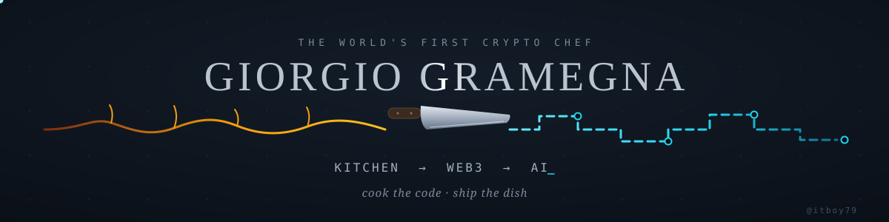
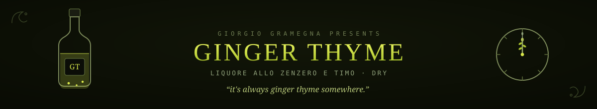
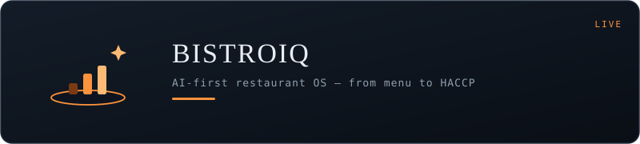
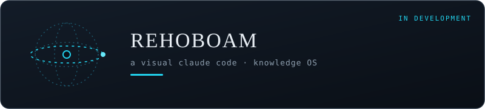
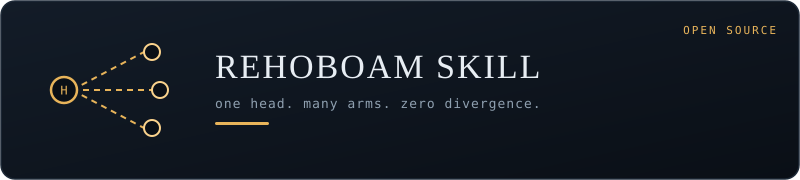
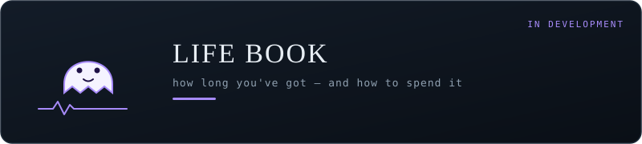
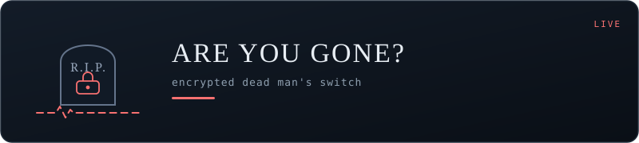
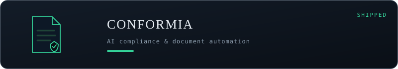
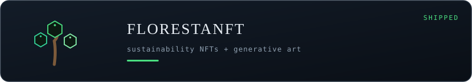

---

## Who am I

I ran a gourmet social club in Milan. I write production code. I've deployed smart contracts and plated tasting menus — sometimes in the same week. People call me the **first Crypto Chef**, and honestly, the label stuck for a reason: I treat software like a kitchen. Everything prepped, everything tested, nothing leaves the pass unless it's right.

Today I'm:

- **Founder** @ [MiraiLab](https://mirailab.it) — blockchain & AI consulting, trained teams for Fastweb Digital Academy and Il Sole 24 Ore
- **Co-Founder** @ [BistroIQ](https://bistroiq.com) — AI-powered restaurant intelligence
- **Co-Founder & Host** @ [Crypto Confidential](https://www.youtube.com/channel/UCxJcRPk2BkYT4Tihz9kxi0w) — the world's first Crypto & AI food talk show
- **CPTO** @ Strategy X / Axentra — venture building, product vision, engineering roadmap
- **Solo builder** of (almost) everything below 👇

Oh, and I distill my own **Ginger Thyme** liqueur. Ginger, thyme, dry. My name is literally on the bottle — that's how much I stand behind what I ship. And remember: no matter your timezone, *it's always Ginger Thyme somewhere.* 🕰️

---

## 🚀 Featured builds

### ⚡ [Bleeb](https://bleeb.dev) · Private Alpha

**Describe it. Bleeb builds it.** From one sentence in plain language to a publishable web app: real automation connectors (Slack, Email, Sheets, Notion, HTTP), RAG-powered project memory, transparent credits. Bring your own keys or run local models — your keys, your models, Bleeb's brain.

`AI agents` · `RAG` · `Multi-model: OpenAI / Anthropic / Ollama` · `Visual editor`

### 🍽️ [BistroIQ](https://bistroiq.com) · Live

**The AI-first restaurant OS.** A modular platform covering the whole restaurant lifecycle: digital menu, orders, kitchen display, floor management, inventory, HACCP compliance and analytics — with machine learning and blockchain traceability baked into the core. Co-founded it because I've run the kitchen side myself: this is the tool I wish I'd had.

`AI-first` · `Modular platform` · `KDS` · `HACCP` · `ML + blockchain traceability`

### 🔮 [Rehoboam](https://rehoboam.it) · In development

**A visual Claude Code.** A knowledge OS with a semantic 3D Sphere, on-device voice, and multi-agent orchestration powered by **AgentEngine** — my own multi-model orchestrator. Local-first (Tauri 2 + Rust, Mac & Android), optional EU-hosted sync. Powerful enough for power users, simple enough for an 85-year-old. Literally — it has a Simple Mode.

`Tauri 2` · `Rust` · `Supabase EU` · `Multi-agent AI` · `On-device voice`

### 🦾 [Rehoboam Skill](https://github.com/itboy79/rehoboam) · Open Source

**One head. Many arms. Zero divergence.** 🦾 A multi-agent build orchestrator for Claude Code: the head plans and writes briefs (never code), parallel executor arms build in isolated git worktrees, and a fresh-context reviewer verifies before anything merges. Provider-agnostic — run it on Anthropic, any OpenAI-compatible API, or local Ollama models. MIT licensed.

`Claude Code skill` · `Multi-agent orchestration` · `Git worktrees` · `Anthropic / OpenAI / Ollama`

### 👻 [Life Book](https://lifeboo.it) · In development

**A life expectancy calculator with an Italian sense of humor.** An ironic PWA with a ghost mascot named Boo. It tells you how long you've got — and how to spend it better.

`Next.js 15` · `Supabase EU` · `next-intl` · `Framer Motion` · `PostHog`

### 🪦 [Are You Gone?](https://areyougone.it) · Live

**An encrypted Dead Man's Switch.** Real-time engagement mechanics, end-to-end encryption, and just the right amount of irony. Life Book's natural companion: first you learn how long you've got, then you plan accordingly.

---

## 🧪 Shipped & cooking

**On the stove:** 🧙 AI Magi (multi-agent deliberation) · 🎮 HTML5 PWA game suite · 🪙 SFT tokenization framework · 🇪🇺 MiCA-compliant EUR stablecoin architecture

---

## 🧰 Stack

**How I work:** local-first when it makes sense, EU infrastructure always, documentation as the source of truth, test + commit + push on every task. *Boring reliability, interesting products.*

---

## 📊 Stats

---

## 📬 Let's talk

🌐 [mirailab.it](https://mirailab.it) · ✉️ hello@mirailab.it · 📍 Milan, Italy

*If you made it this far, Boo says hi.* 👻

**Cook the code. Ship the dish.**

